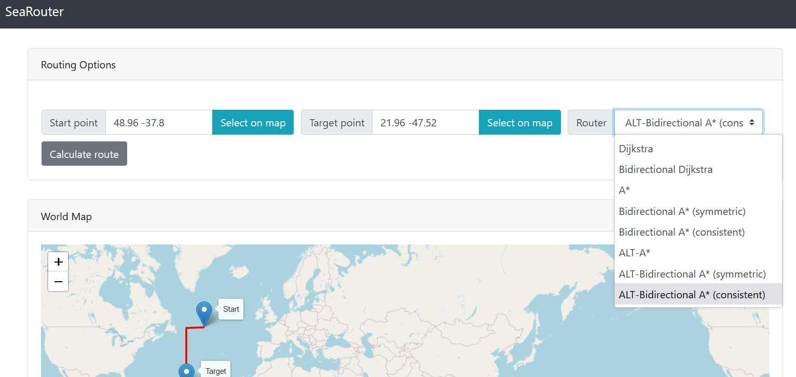

This repository is the outcome of a practical course offered by the University of Stuttgart. The task was to 
implement a routing application for travels on the sea using a grid graph. For routing, different speed-up techniques should be
implemented and tested that perform better than Dijkstra's algorithm. This particular project focuses hereby on ALT algorithms and their evaluation.

**To understand the implementations of the routing algorithms and custom details like different landmark distribution strategies, you are encouraged to have a look at [Sea-Routing.md](./Sea-Routing.md) where this gets explained.**

If you are interested in how the routing algorithms compare, an analysis based on time measurements can be found in [Results.md](./Results.md).

## Installation

Run the following Maven command at the root of the directory tree of this repository.

```shell
./mvnw clean install -DskipTests
```
## How to...

### ... Create a grid graph
First, place a pbf file (must named ```planet-coastlinespbf-cleaned.pbf``` using the default configuraton) containing the coastlines in the
[src/main/resources](./src/main/resources) directory. After this, open the java file
[src/main/java/de/fmi/searouter/dijkstragrid/GridCreator.java](./src/main/java/de/fmi/searouter/dijkstragrid/GridCreator.java).
In it, it is possible to set some parameters which are to be considered in the calculation.
Finally, run the main() method of the class. The result may take some time to be calculated,
depending on both the parameters set and the performance characteristics of the machine
used to execute the application.

**After the calculation of the grid graph a ```.fmi``` file containing the grid definition will be exported to
the route directory of this project.** Its name is ```exported_grid.fmi``` 

#### Parameters to set
- *DIMENSION_LATITUDE*: Number of nodes that are to be generated along any latitude.
  Sets part of the dimensions of the grid.
- *DIMENSION_LONGITUDE*: Number of nodes that are to be generated along any longitude.
  Sets part of the dimensions of the grid.
- *NUMBER_OF_THREADS_FOR_IN_WATER_CHECK*: The number of threads that will be used when
  performing the point-in-water check. The more threads, the faster the calculation will be, provided
  the hardware is capable of supporting the given number of threads. In our tests, we found that double
  the amount of logical cores works pretty well (as long as nothing else should be done at the same time).
- *GRID_FMI_FILE_NAME*: The name of the file the calculated grid will be stored in. (default: ```exported_grid.fmi```)
- *PBF_FILE_PATH*: **Located in a different file!** This parameter is used to change the name of the pbf file
  in the resources directory. By default, the name is "planet-coastlinespbf-cleaned.pbf". If that should be
  changed, it is possible to do so in
  [src/main/java/de/fmi/searouter/coastlinegrid/CoastlineWays.java](./src/main/java/de/fmi/searouter/coastlinegrid/CoastlineWays.java).

### ... Choose a certain ALT configuration

The default configuration is the landmark selection mode ```EQUAL_SPHERE``` using 306 candidate landmarks and 5 active landmarks.

#### Parameters to set
* In [Grid.java](./src/main/java/de/fmi/searouter/dijkstragrid/Grid.java):
  - *USE_LANDMARKS*: Whether landmarks should be initialized or not. Set this to ```false``` if you don't want to use ALT algorithms and want to save computation time and memory.
  - *LANDMARK_DISTRIBUTION_MODE*: Which landmark selection/distribution strategy should be applied. One can choose from: RANDOM, EQUAL_2D, EQUAL_SPHERE, COASTLINE and MAX_AVOID. All distribution modes are explained in detail in [Sea-Routing.md](./Sea-Routing.md).
* In different [LandmarksInitializors](./src/main/java/de/fmi/searouter/landmarks/initializer/)
  - Here it is possible to set the number of candidate landmarks for each distribution mode.
* In [ALT-Router .java files](./src/main/java/de/fmi/searouter/router/alt/)
  - Here it is possible to change the default number of active landmarks that are used by each router.


###  ... Install and run the routing frontend
First place a .fmi file containing the grid graph in the
[src/main/resources](./src/main/resources) directory called
```exported_grid.fmi```.

After this, execute the following commands:
```shell
./mvnw clean install -DskipTests
./mvnw spring-boot:run
```
Finally, open a browser and access the url "http://localhost:8080/".

**Note:** On my PC the web app consumes comparably quite a lot RAM which is why the routing behaves a little slower than with the Evaluation method (see next section).

*The port of the web app can be changed by editing the [application.properties](./src/main/resources/application.properties) file.*



### ... Evaluate and compare different routers on a large scale

First place a .fmi file containing the grid graph in the
[src/main/resources](./src/main/resources) directory called
```exported_grid.fmi```.

The [Evaluator.java](./src/main/java/de/fmi/searouter/evaluation/Evaluator.java) is a class providing means for evaluating large scales of queries for different routers. To use this class simply modify [EvaluatorMain.java](./src/main/java/de/fmi/searouter/evaluation/EvaluationMain.java) and run its main method.

#### Parameters to set
* In [Evaluator.java](./src/main/java/de/fmi/searouter/evaluation/Evaluator.java):
  - *NO_OF_QUERIES*: Number of random routing queries that should be used for the tests.


# Where to find certain task solutions (**Note**: some updates since last evaluation)

## Task 2

PBF file import is performed in [CoastlineImporter.java](./src/main/java/de/fmi/searouter/osmimport/CoastlineImporter.java).
However the whole pre-processing (and also the call of the CoastlineImporters import function is performed in [GridCreator.java](./src/main/java/de/fmi/searouter/dijkstragrid/GridCreator.java))

## Task 3

Since the initial implementation, we have improved the algorithm we use to perform the point-in-water
check. It is now based on a **multi-level grid**. When building this grid we check which coastline has to be
considered within a given grid cell. When doing this, we use different checks to ensure a very accurate 
representation, especially with respect to lines following exact latitudes. This prevents problems caused
by arcs between two points on a sphere. 

All classes used for the multi-level-grid and its point-in-water check can be found in the package
 [coastlinegrid](./src/main/java/de/fmi/searouter/coastlinegrid). 
 
 ## Task 4
 
 Grid Graph: Gets created in the [GridCreator.java](./src/main/java/de/fmi/searouter/dijkstragrid/GridCreator.java) class.
 
 In order to improve the runtime the point-in-water check gets performed multi-threaded.
 
 ### Task 4.1
 
 .fmi file import/export is implemented in [Grid.java](./src/main/java/de/fmi/searouter/dijkstragrid/Grid.java)
 
 ## Task 5
 
 Dijkstra’s Algorithm is implemented in [DijkstraRouter.java](./src/main/java/de/fmi/searouter/router/DijkstraRouter.java) using the
 [DijkstraHeap](./src/main/java/de/fmi/searouter/router/DijkstraHeap.java) as a heap data structure.
 
 ## Task 6
 
 The frontend implementation can be found in the [vue-frontend](./vue-frontend) directory.
 It is a web application available under localhost:8080 (see how to install section).

## Task 7

All in all I implemented seven additional routers that perform better than Dijkstra.
A detailed description of them can be found **[here](./Sea-Routing.md)**.

* Bidirectional Dijkstra [[implementation](./src/main/java/de/fmi/searouter/router/bidijkstra)]
* A* [[implementation](./src/main/java/de/fmi/searouter/router/astar)]
* Bi-A*, symmetric [[implementation](./src/main/java/de/fmi/searouter/router/symmetricastar/)]
* Bi-A*, consistent [[implementation](./src/main/java/de/fmi/searouter/router/consistentbiastar/)]
* ALT-A* [[implementation](./src/main/java/de/fmi/searouter/router/alt/astar/)]
* ALT-Bi-A*, symmetric [[implementation](./src/main/java/de/fmi/searouter/router/alt/symmetricastar//)]
* ALT-Bi-A*, consistent [[implementation](./src/main/java/de/fmi/searouter/router/alt/consistentbiastar/)]
