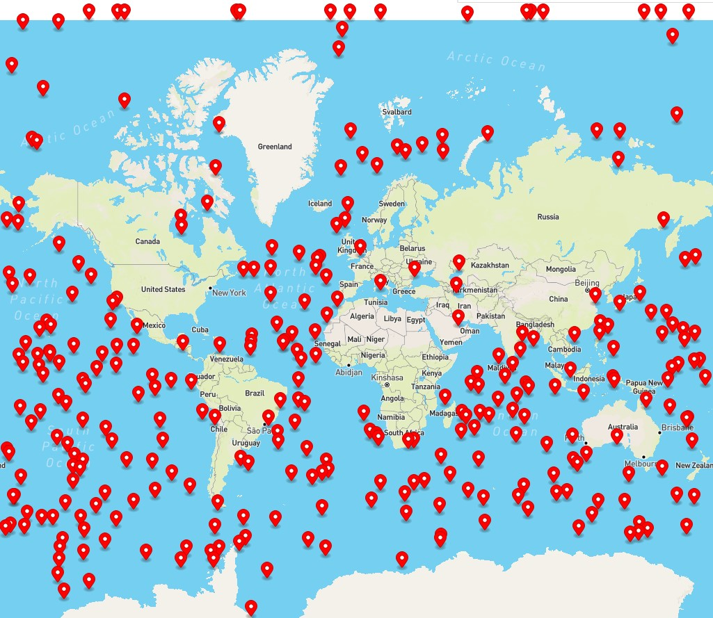
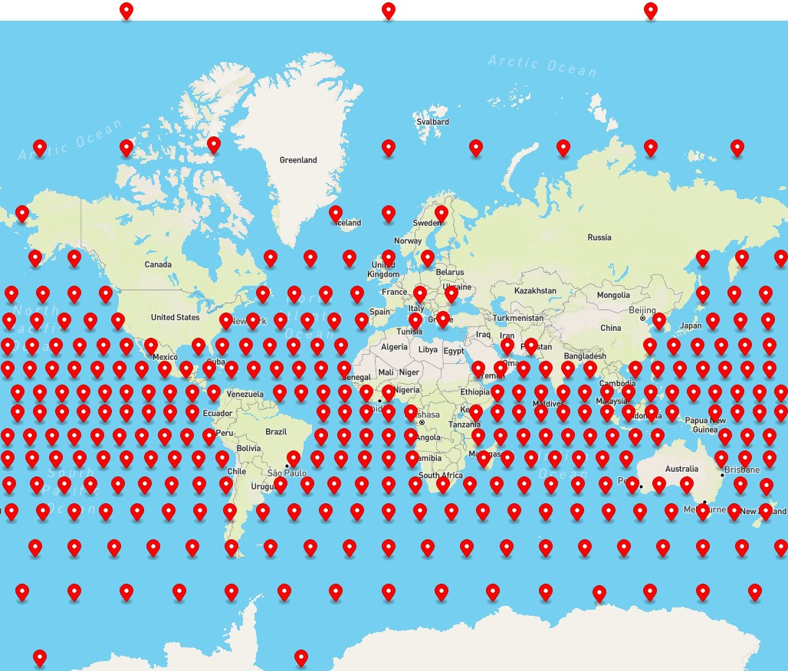
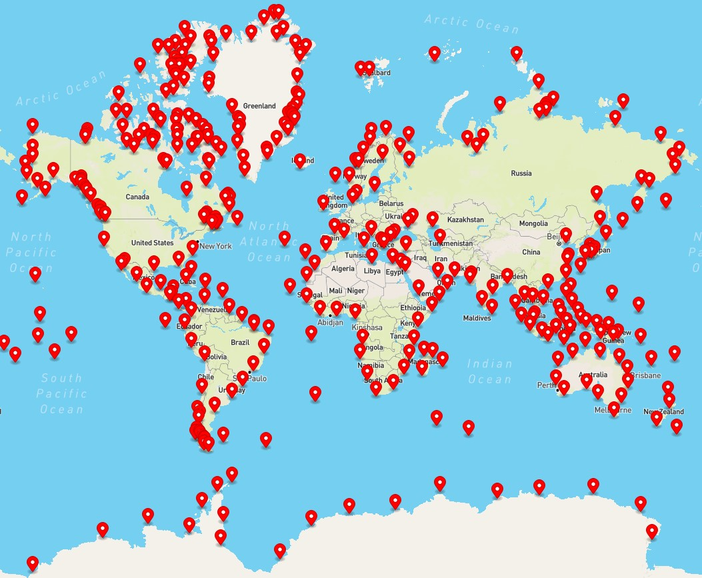

# Results and performance analysis

This project provides five base routers without the need of pre-processing
of which three are variants of $A*$ that can be used for ALT algorithms. 
Furthermore, five different landmark distribution strategies were
implemented. All in all, this ends up in a big number of possible configurations
for the ALT algorithm. The optimal goal of this result analysis would be
to find the best working configuration. 

## Test setup

```
Systemtyp:                    x64-based PC
Prozessor(en):                AMD Ryzen 5 3550H with Radeon Vega Mobile Gfx2.10 GHz (AMD64 Family 23 Model 24 Stepping 1 AuthenticAMD ~1400 MHz)
Gesamter physischer Speicher: 6.083 MB
Virtueller Arbeitsspeicher:   Maximale Größe: 24.513 MB
```

* Per test 1000 routing queries (deterministically randomly generated with a seed) were
processed. 13 of all 1000 queries result in a *No route found* result.
* Before each test, the test was performed once for Dijkstra to get up-to-date comparison times (because they might
depend on the current hardware workload etc.). These times were used for calculating the speed-up factor.
* **After I conducted the tests, I improved the performance for the active Landmark selection further, by using a MaxHeap instead the Collections.sort() method of Java for retrieving the best active landmarks.** Therefore,
these results are outdated but for comparison still suitable.

## Comparison of base routers without the need of pre-processing

| **Router** | Dijkstra | Bidirectional Dijkstra | A* | Bidirectional symmetric A* | Bidirectional consistent A* |
|  --- | --- | --- | --- | --- | --- | 
| **Abs. avg. time** | 211.29 | 198.98 | 137.98 | 170.06 | 202.74 | 
| **No of nodes popped out of heap (avg)** | 333887.18 | 236243.71 | 91336.36 | 107825.79 |91228.80 |
| **Time speed-up (relative to dijkstra)** | 1	| 1.062 | 1.531 |	1.242 | 1.042 |

## Comparison of ALT algorithms

### Number of landmarks per distribution mode

The goal of this test was to find out how the different
distributions of landmarks behave depending on different amounts
of candidate landmarks and on different underlying routing algorithms. Therefore the number of active
landmarks (during query time) was set fixed to five. 

#### RANDOM

As the random strategy chooses randomly nodes as landmarks the "goodness" of this 
approach depends on luck.


**Best configuration:**
* Bidirectional consistent $A*$
* 305 landmark candidates
* **Speed-Up:** 14.94 times faster than Dijkstra
* **Nodes-Pop-Count:** 4647.07

**Best landmark distribution visualized:**



#### EQUAL_2D


**Best configuration:**
* Bidirectional consistent $A*$
* 233 landmark candidates
* **Speed-Up:** 12.48 times faster than Dijkstra
* **Nodes-Pop-Count:** 7218.71

**Best landmark distribution visualized:**


#### EQUAL_SPHERE


**Best configuration:**
* Bidirectional consistent $A*$
* 306 landmark candidates
* **Speed-Up:** 14.73 times faster than Dijkstra
* **Nodes-Pop-Count:** 4677.07

**Best landmark distribution visualized:**



#### EQUAL_COASTLINE

Here additionally two different variants were tested. One with 500km minimum between 
two nodes and another with 1000km.


**Best configuration:**
* Bidirectional consistent $A*$
* 370 landmark candidates
* 1000km distance heuristic between nodes
* **Speed-Up:** 15.32 times faster than Dijkstra
* **Nodes-Pop-Count:** 4857.07

**Best landmark distribution visualized:**



### Number of active landmarks depending on distribution mode

For all best configurations the next test tries to figure out how the measurements behave
while differing the number of active landmarks.

*Note: After I calculated the results above I recognized that mit evaluation algorithm didn't considered the 13 negative results for computing averages. I changed this for all following measurements. This might also be a reason why the absolute results differ a little bit. However, the previous analysis of the "goodness" of the landmark candidate size per distribution should not be influenced within one distirbution. Also, I rebooted my PC once which changed the overall number tendencies a bit.*

#### RANDOM


**Best configuration:**
* 4 active landmarks
* **Speed-Up:** 16.21 times faster than Dijkstra
* **Nodes-Pop-Count:** 5249.02

#### EQUAL_2D


**Best configuration:**
* 8 active landmarks
* **Speed-Up:** 12.82 times faster than Dijkstra
* **Nodes-Pop-Count:** 5749.65

#### EQUAL_SPHERE


**Best configuration:**
* 5 active landmarks
* **Speed-Up:** 16.12 times faster than Dijkstra
* **Nodes-Pop-Count:** 4625.88

#### COASTLINE


**Best configuration:**
* 6 active landmarks
* **Speed-Up:** 15.52 times faster than Dijkstra
* **Nodes-Pop-Count:** 4648.69

### Overall comparison

Measurement | RANDOM | EQUAL_2D | EQUAL_SPHERE | EQUAL_COASTLINE |
| --- | --- | --- | --- | --- |
| Speed-Up | 16.21 | 12.82 | 16.12 | 15.52 |

## Learnings and Discussion

**A:** Within all ALT variants, Bi-A* (Sym.) performs better than A* and Bi-A* (Cons.) performs better than Bi-A* (Sym.).
* Explanation: This is the right order that is theoretically intendent (see [Theoretical explanations](./Sea-Routing.md)). Bi-A* implemantations reduce the search space compared to A*. Hereby the symmetric implemenation is worse due to the weaker termination condition that allows "to overlap" both searhes before it actually terminates. This is also reflected by
the higher number of nodes popped out of the heap on average.

**B:** The non-ALT implementations (using the Haversine distance heuristic) of Bi-A* perform worse than non-ALT-A*.
* Explanation: This might be due to two reasons: The first fone is that calculating the Havertsine distance is very costly. The consistent bidirectional A* uses in one heuristic call two times this computation. Also, the Havertsine distance
works already quite well for most of the queries which is why only a few nodes popped out of the heap are saved. The symmetric A* has the problem with its weak termination condition resulting in more nodes that need to be scanned.

**C:** The optimal number of active landmarks and the total candidate landmarks differ.
* Explanation: Depending on the total number of candidate landmarks the distrubition of landmarks changes which is why they might perform differently for different distributions. This is the same for the number of active landmarks. It is furthermore to find the sweet-spot between "many landmarks to choose from" and computation time that is needed before each query for finding the active landmarks from all candidate landmarks and then for calculating the heuristics for all active landmarks each time the heuristic function is called.


**D:** ALT-A* works much noticable worse with the COASTLINE_DISTRIBUTION variant than with other distributions.
* This might be because A* is not bidirectional which is why more central landmarks are missing more than with bidirectional variants where one needs mainly the landmarks before start and destination as they are coming from both directions.

**E:** In the end RANDOM, EQUAL_SPHERE and EQUAL_COASTLINE have quite similar speed-up values once they are to some degree "optimized" regarding landmark candidates and active landmarks numbers.
* It seems that for the distribution of landmarks on the grid graph it is most important that the landmarks are to some degree distributed equally over the sphere. Besides that it does not matter really much where the concrete position of the landmark is (e.g. near coastlines). For RANDOM the distribution depends on luck which is why no real statement can be made for this distribution. The EQUAL_2D however performs worse possibly because it does not perform an equal distribution. **However, the tests with 1000 queries is actually a quite small number, so maybe other query sets would find different conclusions.**
* **FOR FUTURE WORK:** It is conceivable that a kind of reinforcement learning algorithm with a sufficient number of test queries should give the best query times. However the computation time would be extremly larger for this.