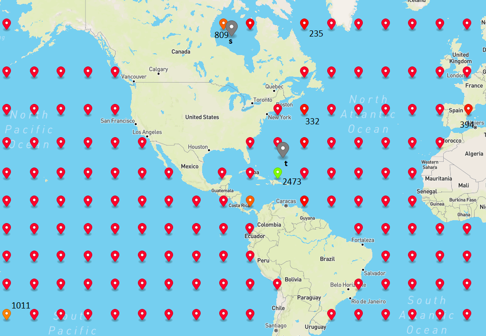

# Basic routing algorithms without the need of preprocessing 

This projects includes five different routing algorithms that work directly on the graph without the need of further preprocessing. These are two variants of Dijkstras algorithm and three variants of the $A*$ algorithm.

## Dijkstra algorithm [[implementation](./src/main/java/de/fmi/searouter/router/dijkstra)]

Dijkstra's algorithm provides the conceptual basis for most routing algorithms. The idea is to calculate all distances to directly neighboring nodes starting from a currently considered node and, if the distance is smaller than previously calculated distances to this node, to update them in a global list. The first considered node is the start node. After that, the node that currently has the smallest distance to the start node and has not yet been considered is always considered next. The search ends as soon as the target node has been reached. 
The shortest path can then be output by storing the predecessor node of each considered node that was on the shortest path to this node.

The data structure which always provides the next node to consider is in the following referred to as the *Priorty Queue*. In practice, this is often implemented using a Min-Heap.
The weight of a vertex inside this Priority Queue is given by a function $k(v)$ with $v \in V$. For Dijkstra this function is defined by simply using the distance $d_s(v)$ of a vertex $v$ to the start vertex $s$:

$k(v)=d_s(v)$

## $A*$ algorithm [[implementation](./src/main/java/de/fmi/searouter/router/astar)]

$A*$ works in the same way as Dijkstra with one addition concering the priority queue. Instead of solely sorting the next nodes to consider based on their current distance to the start node, additionally a heuristic function is applied that estimates the distance to the target node.  

$k(v)=d_s(v)+\pi_t(v)$ with $\pi_t(v)$ being the heuristic function estimating the distance of the node $v$ to the target node $t$.

The intuition of this approach is that with the heuristic the next node that is considered by $A*$ is already targeted towards the target node. Dikstra instead only consideres the edge weights for the Priority Queue which results basically in a circle-like search space if the graphs vertices would be equally distributed around the start node. With the heuristic the search space is therefore more directed towards the target node and is more likely to find the consider the target node as next node more earlier. This is equivalent to saying that the number of nodes popped out of the Priority Queue is smaller.

### Properties and constraints of $\pi_t(v)$

Not every function $\pi_t: V\rightarrow\mathbb{R}$ can be used for the $A*$s heuristic. A herustic function $\pi_{t}$  that works for $A*$ is called admissible by fullfiling the following properties:

$d_t(v)\geq\pi_t(v)$ for all $v \in V$ and $t \in V$ being target node.

This is consistent with the mathematical intuition that the heuristic $\pi_t$  must never overestimate the cost to the target node. E.g., the estimated distance to the target node must never be longer than the actual length of the path. This would result in popping out nodes from the heap first, that actually are not on the shortest path to the target node and therefore it could happen that the algorithm stops because the target node was found,  although the found path is suboptimal. Underestmating all distances in contrary, the resulted path keeps always correct. This is due to $d_t(v)\geq\pi_t(v)$ and therefore at some point, before finding the target node on a sub-optimal path, $k(v)$ for a vertex $v$ on the suboptimal path will always become bigger than the $k(w)$ value of a vertex $w$ which is really on a optimal path.

#### Equivalent definition of admissible via a modified graph definition

$\pi_t$ is admissible when:

* $\pi_t(t) \leq 0$, $t$ being the target vertex
* $\pi_t$  is feasible

**Definition of feasible**
 Let $l(v,w)$ be the costs of an edge between the vertices $v \in V$ and $w \in V$. Let $l_{\pi}(v, w)$ be the so-called reduced costs of an edge, defined by: $l_{\pi}(v, w)=l(v, w)-\pi_t(v)+\pi_t(w)$.
$\pi_t$ is then called feasible if $l_{\pi}$ is nonnegative for all edges.

(Note that if $l_{\pi}$ would be used instead of $l$ as edge costs function for the graph with $A*$, this $A*$ would work equivalent to Dijkstras algorithm. The graph with $l_{\pi}$ is often referred to as *modified graph*).

### Implementation details

* As the grid graph of the searouter is situated on the earths surface, the arc distance between two nodes on earth in meters is used as a heuristic function $\pi_t(v)$.
It is not possible to use simply euclidean distances (assuming that the earth would be flat) as then it might come true, that $\pi_t$ overestimates some distances.
(TODO check this up, maybe try euclidean distances as well)
* In order to avoid calculating the heuristic function multiple times for the same vertex, all previously calculated heuristic results are cached for the respective vertex.

## Bidirectional Dijkstra [[implementation](./src/main/java/de/fmi/searouter/router/bidijkstra)]

Dijkstra looks first at all vertices that are nearest to the start point to find a route to the destination.
Within a grid graph however, this results in a circle-like search space until the circumference of this great circle
intersects with the target vertex (if one disregards obstacles). To reduce the size of this circle, and therefore the number of nodes that need to be popped
out of the heap, one can alternate between a dijkstra starting from the start vertex and one dijkstra algorithm starting
from the destination node. In this way, the search space is given by two smaller circles and the overall
search space can be reduced. This is because the area $A$ of a circle is given by $A = 2 * \pi * r^2$.
The search area of two circles with half the radius of the big circle would be $2A = 4 * \pi * (r/2)^2 = 4 * \pi * r^2/4 = \pi * r^2$.
This shows that in such a case the search space would be halved.

### Implementation details

My implementation of Bidirectional Dijkstra alternates the forward and backward search, starting with the forward
search. The termination condition for the bidirectional dijkstra can be either true as soon as the forward search pops
a vertex from the forward heap that was already popped from the backward heap too (or vice-versa), or:
$k_{forward}(vertexPoppedFromForwardHeap)+k_{backward}(vertexPoppedFromBackwardHeap) > minPathLengthFoundSoFar$.
The first variant was chosen for my implementation.
In both variants it is important to track the currently shortest path that was found between start and destination as soon as an edge is considered
of which the destination node was already popped from the heap of the search from the other direction. In addition, also the 
 node IDs of this "meeting point" between the two searches must be stored temporarily to be able to reconstruct the path.
  
This buffered information assures that when
the stop condition becomes true, also the shortest path is returned, because it is not guaranteed that e.g. the path between a node
that was already popped out from the forward and backward heap having an edge between each other is actually the shortest path.
     
## Bidirectional AStar

The speed-up idea behind Bidirectional AStar is basically the same as with Bidirectional Dijkstra.
However, depending on the used heuristic, it is likely to expect that the effect of the reduced search space
becomes strongly weakened compared to Dijkstra. This is because the AStar search space is usually already more 
directed towards the destination node which is why no "search circle" will arise during runtime.

The difficulity of Bidirectional AStar implementations is to find correct the termination condition.
**The stop condition of bidirectional Dijkstra can only used for Bidirectional AStar as well, if
the heuristic functions $\pi_t$ and $\pi_s$ are consistent.**

**Definition of consistent:** $\pi_t$ and $\pi_s$ are consistent if for all edges $(v, w)$ the
weight of the edge in the modified graph $l_{\pi_t}(v, w)$ is equal to the length of this edge in the 
"reverse modified graph" using $\pi_s$ as heuristic: $l_{\pi_s}(w, v)$.

The mathematical intuition of this can be explained in such a way, that the forward search (using
$\pi_t$ as heuristic) and the backward
search (using $\pi_s$ as heuristic) must be performed on the same (modified) graph to be able to make statements whether the
shortest path was yet found or not.

**However, the linear distance between two geographical in general is not a consistent heuristic:**

To prove this, I created the following counter-example:

          
$l_{\pi_t}(v, w)= l(v, w) - \pi_t(v) + \pi_t(w) = 1 - \sqrt{5} + 2 = 0.7639$

$l_{\pi_s}(w, v)= l(w, v) - \pi_s(w) + \pi_s(v) = 1 - 3 + 2 = 0$

$\Rightarrow l_{\pi_t}(v, w) \neq l_{\pi_s}(w, v)$

In order to be able to use linear distance on earth as a heuristic for Bidirectional AStar in despite, I
implemented a *symmetric* and *consistent* variant of Bidirectional AStar, both enabling the use of inconsistent heuristics.

### Symmetric Bidirectional AStar [[implementation](./src/main/java/de/fmi/searouter/router/symmetricastar)]

The termination condition for Symmetric Bidirectional AStar is basically the same as the second one in Bidirectional Dikstra with one 
important change. As we work with a potentially non-consistent heuristic that results in two different
modified graphs for the forward and reverse search, it is not guaranteed that we found
the shortest path as soon as the sum of the latest popped out vertices of the two heaps is bigger than the
minimum path length we found so far. Instead, we only apply this termination condition by looking separated
at the modified graph of the forward and of the backward search. This results in two termination conditions:

* $k_{forward}(v) > minPathLengthFoundSoFar$, $v \in V$ being a vertex popped from the forward heap
* $k_{backward}(v) > minPathLengthFoundSoFar$, $v \in V$ being a vertex popped from the backward heap

This however means that the stopping condition tends to be much later true during runtime compared to using Bidirectional Dijkstras
termination condition. Spoken in pictures, the search areas of the two AStars can already overlap far before actually stopping
the search.

#### Further implementation details

* Like Goldberg et. al. the implementation uses the improvement described by Kwa (J. Kwa. BS*: An Admissible Bidirectional Staged Heuristic Search Algorithm. Artif. Intell., 38(1):95{109,1989.)
that when an arc $(v, w)$ is scanned of which
$w$ has been already scanned from the other directed search, $w$ is ignored (including not added to the heap).
This avoids to look at vertices twice by the forward and backward search, which is not necessary as we know already the distance
to $w$ from the other direction.                                                                       

### Consistent Bidirectional AStar [[implementation](./src/main/java/de/fmi/searouter/router/consistentbiastar)]
            
With this implementation variant it is possible to use the same termination condition like Bidirectional Dijkstra.
This is done by making a non-consistent heuristic consistent by using an additional computation that wraps the inconsistent
function. For doing this, [Ikeda et al.](https://ieeexplore.ieee.org/document/396824) use the following wrapper functions that
replace the normal heuristics:

* $p_s(v)=0.5 * (\pi_t(v)-\pi_s(v))$
* $p_t(v)=0.5 * (\pi_s(v)-\pi_t(v))$

The proof that $p_s(v)$ and $p_t(v)$ together are consistent can be read in their paper. 

# ALT algorithm

I've implemented three base versions of the ALT algorithm using different underlying A* routers.

* ALT-A* [[implementation](./src/main/java/de/fmi/searouter/router/alt/astar/)]
* Bi-ALT-A* (sym.) [[implementation](./src/main/java/de/fmi/searouter/router/alt/symmetricastar/)]
* Bi-ALT-A* (cons.) [[implementation](./src/main/java/de/fmi/searouter/router/alt/consistentbiastar/)]

The basic idea of the ALT speed-up technique is to take a heuristic-based path finding algorithm like $A*$
and improve its heuristic function. In general, the best possible heuristic function would return the real
distances of the nodes to the target node on the path. In this case and if there would be no vertices
in the search area with the same distance, this would result in popping only the nodes from the heap
that are already on the shortest path to the target node. 

**In general:** The bigger the heuristic function is (while being admissible and thus not overestimating
the real distances), the fewer nodes will be popped out of the heap. 

Currently, all implemented variants of $A*$ use the linear distance to the target as heuristic. This
is physically the lowest bound possible for estimating distances in a geographical-based graph. To achieve
a heuristic that is more close to the real distances using the graph, ALT algorithms
precompute for chosen vertices all distances to the other vertices in the graph. This information can then
be used at query time to make more realistic estimates what the distance to target nodes is.

The following example shows a practical example where landmarks would reduce the number of nodes considered in $A*$:

Without a landmark, using the linear distance as a heuristic, all blue vertices
would be popped out of the min heap of $A*$ before the really important nodes for 
the shortest path would be considered. However, if there would be a landmark near the nodes, this
landmark would know due to its preprocessing that the shortest path actually will be found going north instead of 
going south. Especially for such cases with obstacles, it makes sense to use landmark distance informations as replacement
for linear distance heuristics as they have knowledge about the structure of the graph.

To get a heuristic for $A*$ that uses landmark distance information while being still admissible (no overestimating allowed),
the triangle inequality can be used:
             
$dist(s, t) \geq |dist(v, L) - dist(t, L)| = \pi_t(x)$. $L \in V$ being a landmark, $v \in V$, $t \in V$ being the target/destination node.

This new heuristic function itself is more efficient to compute than computing the linear distance between two nodes on earth
using the Haversine forumala. All in all, this results in two additional speed-up factors of ALT algorithms:

1. Better heuristic for $A*$ algorithms
2. More time-efficient heuristic function 

## ALT computation phases [[implementation](./src/main/java/de/fmi/searouter/landmarks/Landmark.java)]

### Pre-processing

1. Choose a set of candidate landmarks.
2. Compute all distances to all vertices from these landmarks (using Dijkstra without stop condition).
3. Cache the pre-processed information in memory. 

### At query-time

1. Of all available landmarks: Choose a small number that works best on the start-target distance. This set of landmarks is called active landmarks.
2. Use this set of landmarks to compute the maximum heuristic for a given vertex $v \in V$.

For example for the heuristic $\pi_t(v)$ that estimates $dist(v, t)$ with $t \in V$ being the destination node of the query, the overall heuristic function would be.

$\pi_t(v) = max_{l \in L_{active}}(\pi_t(v))$

$L_{active} \in L$ being the set of active landmarks.

## What are good landmarks?   

Goldberg et al. state in their paper first presenting ALT algorithms: 
> For road graphs and other geometric graphs, having
a landmark geometrically lying behind the destination
tends to give good bounds.

To check how this behaves with the grid graph used for this project I made several tests.
I visualized for a variant of ALT that uses all candidate landmarks as active landmarks the 
number of usages of these landmarks within certain queries. Some of the results can be
seen in the following:

**Legend:**
* The brighter green landmarks are the often they were used.
* Grey points are the query vertices (start and destination).

**A**

**B**

**C**

**D**

Looking at this pictures the claim of Goldberg et al. seems to be also in general true for our grid graph. 
The best landmarks are always very near the start/destination points. Nevertheless, there
are also landmarks that perform good as well but are located not near the query vertices. 
This is for example the case for the green landmark in example D near Malaysia (546 times used) or the landmark on the bottom left in example A.

## Distribution strategies

I have implemented five different distribution strategies for landmarks that I will present briefly in the course of this section.

### RANDOM [[implementation](./src/main/java/de/fmi/searouter/landmarks/initializer/RandomLandmarkInitializer.java)]

Chooses randomly landmarks from the set of all vertices $V$.

### EQUAL_2D [[implementation](./src/main/java/de/fmi/searouter/landmarks/initializer/EqualDistributed2DMapInitializer.java)]

Landmarks are distributed equally on the water parts of the earth under the assumption
that the earth is flat and thus, distances between latitudes/longitudes constant. Therefore
the resulting distribution is in real not equally distributed.

### EQUAL_SPHERE [[implementation](./src/main/java/de/fmi/searouter/landmarks/initializer/EqualDistributedOnSphereInitializer.java)]

Same as 2D but with the knowledge that the earth can be approximated as a sphere. 
The algorithm for the equal distribution on a sphere was implemented as described [here](https://www.cmu.edu/biolphys/deserno/pdf/sphere_equi.pdf).

### COASTLINE [[implementation](./src/main/java/de/fmi/searouter/landmarks/initializer/CoastlineLandmarkInitializer.java)]

This strategy was inspired by Goldberg et al.s "planar landmark selection" algorithm idea which is claimed to be a good distribution strategy for planar graphs (like our grid graph).

Quote from their paper:
>First, find a vertex c closest to
the center of the embedding. Divide the embedding
into k pie-slice sectors centered at c, each containing
approximately the same number of vertices. For each
sector, pick a vertex farthest away from the center.

This results in landmarks that are on maps always near to the border. 

Sources: [left image](https://www.microsoft.com/en-us/research/wp-content/uploads/2004/07/tr-2004-24.pdf), [right image](http://www.columbia.edu/~cs2035/courses/ieor6614.S11/goldberg.pdf)

**However, on the whole earth with using a grid graph this strategy is not applicable.** The earth is a sphere which is why it is not possible to cut "pie slices" without having a second intersection point on the antipodal point of the center which would be a second center. 

With this in mind and knowing from the previous experiments (see "What are good landmarks?" section) that landmarks near coastlines tend to be quite good I developed the COASTLINE distribution strategy.

It basically chooses a landmark near a coastline one after eachother but under the constraint that no other landmark in the current set of candidate landmarks has a distance (on the graph) that is smaller than a heuristic value (e.g. 1000km). This should assure that the landmarks are equally distributed over all coastlines. All in all, this should in the end follow the same idea like the selection algorithm of Goldberg et al. for planar graphs on maps.

### Max-Avoid [[implementation](./src/main/java/de/fmi/searouter/landmarks/initializer/MaxAvoidInitializer.java)]

I tried (and succeeded to some degree) to implement the "farthest landmark selection" algorithm described by Goldberg et al. for graphs on a sphere:

>Pick a start vertex and find a vertex v1
that is farthest away from it. Add v1 to the set of
landmarks. Proceed in iterations, at each iteration
¯nding a vertex that is farthest away from the current
set of landmarks and adding the vertex to the set.

I used a calculation of a geographic midpoint for retrieving the farthest landmark away from a current set of landmarks. However, it turned out that this doesn't work very well, because very soon landmarks get "clustered", which means that there are many landmarks next to each other. This might be mainly because very soon with many landmarks the geographic midpoint gets kind of fixed and all further landmarks are chosen therefore from the same region.

# References

* [Goldberg, Andrew V., and Chris Harrelson. "Computing the shortest path: A search meets graph theory." SODA. Vol. 5. 2005.](https://www.microsoft.com/en-us/research/wp-content/uploads/2004/07/tr-2004-24.pdf)
* [Goldberg, A.: Point-to-Point Shortest Path Algorithms
with Preprocessing](http://www.columbia.edu/~cs2035/courses/ieor6614.S11/goldberg.pdf)
* [T. Ikeda et al., "A fast algorithm for finding better routes by AI search techniques," Proceedings of VNIS'94 - 1994 Vehicle Navigation and Information Systems Conference, 1994, pp. 291-296, doi: 10.1109/VNIS.1994.396824.](https://ieeexplore.ieee.org/document/396824)
* [Kwa, James BH. "BS∗: An admissible bidirectional staged heuristic search algorithm." Artificial Intelligence 38.1 (1989): 95-109.](https://www.sciencedirect.com/science/article/abs/pii/0004370289900696)
* [Tower, M, "Bidirectional Dijkstra". Matthew Tower's homepage (2020)](https://www.homepages.ucl.ac.uk/~ucahmto/math/2020/05/30/bidirectional-dijkstra.html)